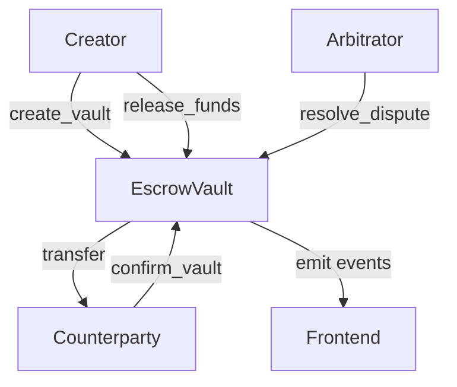

# Esca Smart Contracts

This directory contains the Move smart contracts for the Esca escrow platform on Sui blockchain.

## 📁 Structure

```
contracts/
├── Move.toml              # Move package configuration
├── sources/
│   ├── escrow_vault.move  # Main escrow vault for coins (SUI, USDC)
│   └── nft_escrow.move    # NFT escrow vault for digital assets
└── README.md
```

## 🔧 Smart Contracts

### 1. EscrowVault (`escrow_vault.move`)

Main contract for handling coin-based escrow transactions.

**Key Features:**
- Multi-asset support (SUI, USDC, custom coins)
- Time-locked escrow with expiry
- Arbitrator-based dispute resolution
- State management (Pending → Confirmed → Completed)
- Event emission for frontend integration

**Main Functions:**
- `create_vault<T>()` - Create new escrow vault
- `confirm_vault<T>()` - Counterparty confirms the vault
- `release_funds<T>()` - Creator releases funds to counterparty
- `cancel_vault<T>()` - Cancel vault (before confirmation)
- `dispute_vault<T>()` - Initiate dispute
- `resolve_dispute<T>()` - Arbitrator resolves dispute

### 2. NFTEscrow (`nft_escrow.move`)

Specialized contract for NFT and object escrow transactions.

**Key Features:**
- Generic NFT support for any `key + store` object
- Safe NFT wrapping during escrow
- Same state management as coin escrow
- Support for dispute resolution

**Main Functions:**
- `create_nft_vault<T>()` - Create new NFT escrow vault
- `confirm_nft_vault<T>()` - Counterparty confirms NFT vault
- `release_nft<T>()` - Release NFT to counterparty
- `cancel_nft_vault<T>()` - Cancel NFT vault
- `dispute_nft_vault<T>()` - Initiate NFT dispute
- `resolve_nft_dispute<T>()` - Arbitrator resolves NFT dispute

## 🚀 Deployment

### Prerequisites

1. **Install Sui CLI**
   ```bash
   cargo install --locked --git https://github.com/MystenLabs/sui.git --branch mainnet sui
   ```

2. **Set up Sui Client**
   ```bash
   sui client new-env --alias mainnet --rpc https://fullnode.mainnet.sui.io:443
   sui client switch --env mainnet
   ```

3. **Create/Import Wallet**
   ```bash
   # Create new wallet
   sui client new-address ed25519
   
   # Or import existing wallet
   sui keytool import "your-private-key" ed25519
   ```

### Deployment Steps

1. **Navigate to contracts directory**
   ```bash
   cd contracts
   ```

2. **Build the contracts**
   ```bash
   sui move build
   ```

3. **Deploy to network**
   ```bash
   # Deploy to testnet
   sui client publish --gas-budget 20000000
   
   # Deploy to mainnet (ensure you have mainnet SUI)
   sui client publish --gas-budget 50000000 --skip-dependency-verification
   ```

4. **Save deployment info**
   After deployment, save the package ID and object IDs for frontend integration.

### Environment Setup

Create a `.env` file with deployment information:

```env
# Network configuration
SUI_NETWORK=testnet  # or mainnet
SUI_RPC_URL=https://fullnode.testnet.sui.io:443

# Contract addresses (update after deployment)
ESCROW_PACKAGE_ID=0x...
VAULT_CREATION_CAP_ID=0x...

# Gas settings
DEFAULT_GAS_BUDGET=20000000
```

## 🧪 Testing

### Unit Tests

Run Move unit tests:
```bash
sui move test
```

### Integration Tests

Test with Sui CLI:
```bash
# Test vault creation
sui client call --package $PACKAGE_ID --module escrow_vault --function create_vault \
  --args $COIN_OBJECT $COUNTERPARTY_ADDRESS $EXPIRY_TIME "Test vault" \
  --gas-budget 10000000

# Test vault confirmation
sui client call --package $PACKAGE_ID --module escrow_vault --function confirm_vault \
  --args $VAULT_OBJECT \
  --gas-budget 10000000
```

## 📊 Events

The contracts emit events for frontend integration:

### Escrow Vault Events
- `VaultCreated` - When a new vault is created
- `VaultConfirmed` - When counterparty confirms
- `VaultReleased` - When funds are released
- `VaultDisputed` - When a dispute is initiated

### NFT Escrow Events
- `NFTVaultCreated` - When a new NFT vault is created
- `NFTVaultConfirmed` - When counterparty confirms NFT vault
- `NFTVaultReleased` - When NFT is released
- `NFTVaultDisputed` - When an NFT dispute is initiated

## 🔒 Security Considerations

1. **Access Control**: Only authorized parties can perform vault operations
2. **Time Locks**: Vaults have expiry times for automatic cancellation
3. **State Validation**: Proper state transitions are enforced
4. **Asset Safety**: Assets are safely held in contract until release
5. **Arbitration**: Optional arbitrator for dispute resolution

## 🏗️ Architecture



## 📝 License

MIT License - see [LICENSE](../LICENSE) for details.

## 🤝 Contributing

1. Follow Move coding standards
2. Add comprehensive tests for new features
3. Update documentation for API changes
4. Ensure gas optimization for all functions

## 📞 Support

For contract-specific issues:
- Create an issue in the repository
- Contact the contract engineering team
- Review Move documentation: https://move-book.com/